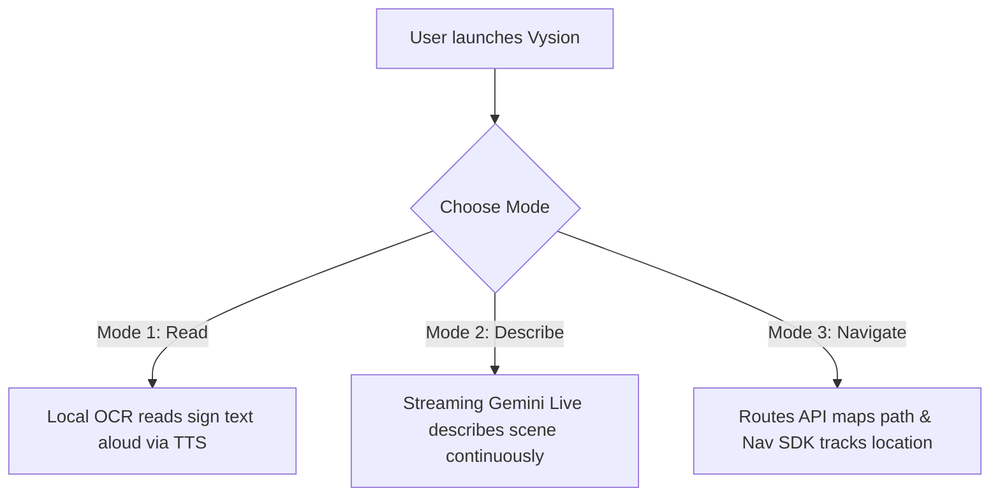
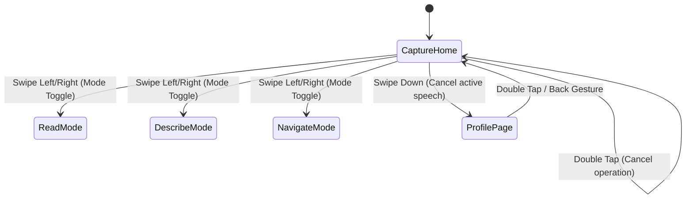
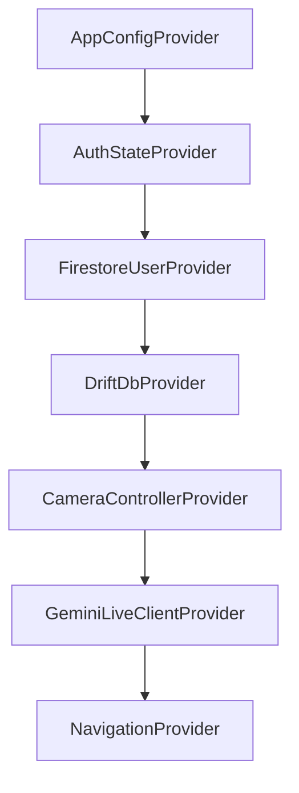
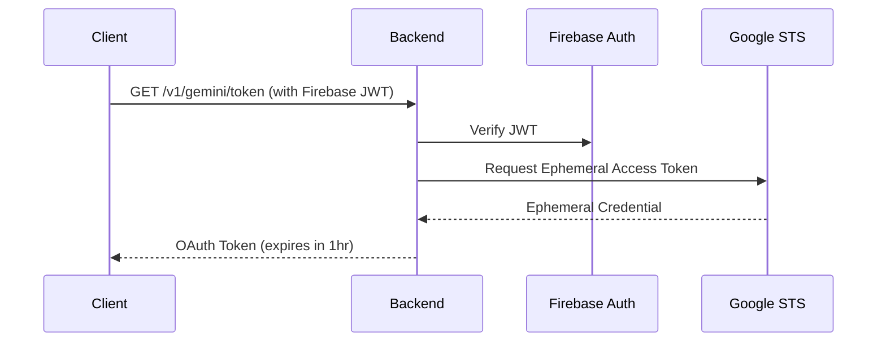

# Vysion (v2) System Architecture Blueprint

This document specifies the technical design, protocols, schemas, and verification strategies for Vysion v2. This rebuild focuses on accessibility, real-time AI capabilities via Gemini Live, local sqlite persistence (Drift), and type-safe Riverpod state management.

---

## Phase 1: Product Overview

### Vision
Vysion is an accessibility-first co-pilot app designed to act as eyes for blind and low-vision users. It processes real-time video frames and audio inputs, translating physical layouts, printed texts, and environmental hazards into descriptive spoken guidance and precise haptic feedback.

### Problem Statement
Existing helper tools either require heavy manual photo-taking, lack real-time conversational navigation guidance, or utilize generic AI persona descriptions that contain useless visual descriptions (e.g., "the store is next to the blue car" or "look over there"). Vysion solves this with:
- Offline OCR (immediate, local camera text processing).
- Bidirectional Gemini Live audio-visual streams.
- Accurate route mapping tailored specifically to non-visual guidelines.

### Personas

#### Primary Persona: Marcus (Urban Commuter)
- **Profile**: 34-year-old blind software engineer living in Boston. Commutes daily via subway.
- **Needs**: Real-time obstacle alerts (construction zones, stairs), transit sign reading, and turn-by-turn walking navigation mapped via clock-face orientation.
- **Constraints**: Relies fully on screen readers (VoiceOver) and a single bone-conduction earpiece.

#### Secondary Persona: Elena (Elderly with Macular Degeneration)
- **Profile**: 71-year-old retired teacher. Has low peripheral vision.
- **Needs**: Document reading (medicine labels, mail), voice control, and large-text settings page.

### Core User Journeys



1. **Read a Sign (Offline Mode)**: Marcus holds his camera up to a transit sign. The local ML Kit OCR processes the camera frame, extracts text, and speaks it immediately without network latency.
2. **Describe a Scene (Gemini Live)**: Marcus sits in a park and wants to know his surroundings. He enters Describe Mode. The camera feeds frames to Gemini Live, which returns rich audio descriptions of people, paths, and objects.
3. **Navigate to a Coffee Shop**: Marcus says "Navigate to Starbucks." Gemini Live parses the request, calls the client tool `getRoute`, and plays turn-by-turn instructions using exact meter distance and clock-face angles relative to his current heading.

### Success Metrics
- **Time-to-First-Instruction**: < 1.2 seconds from destination request to navigation guidance.
- **Hazard-Warning Latency (p95)**: < 300ms from camera frame capture to hazard audio output.
- **OCR Success Rate**: > 92% character accuracy on standard text surfaces under variable lighting.
- **Navigation Completion Rate**: > 95% successful arrivals without orientation drift.

---

## Phase 2: Complete UX Documentation

### Screen-by-Screen Breakdown

1. **Onboarding Screen**: Text-to-speech auto-starts. Introduces the gesture system. Requests permissions (Camera, Location, Audio) via large-hit targets. Plays `assets/sounds/orientation.mp3` once.
2. **Auth Screen**: Minimal email/password or biometric login page. Form fields are accessible with descriptive labels and clear error announcements.
3. **Capture / Home Screen**: The core interface. It is a single full-screen viewfinder overlayed with invisible gesture pads.
4. **Settings Screen**: Accessible list allowing modification of speech rate, haptic intensity, offline storage size limits, and navigation preferences (e.g. avoid stairs).
5. **Profile Screen**: User account management with options to link anonymous credentials to Google/Apple accounts.

### Gesture-State Diagram



### Sitemap

```
Home (CaptureView)
 ├── Read Mode (Offline)
 ├── Describe Mode (Gemini Live Audio-Visual Stream)
 ├── Navigate Mode (Turn-by-Turn + Maps + Live co-pilot)
 └── Profile & Settings (Swipe Down)
      ├── Account Info
      ├── Voice Settings
      ├── Persistence Controls
      └── Offline History
```

---

## Phase 3: Complete UI Documentation

### Wireframe (ASCII Viewfinder Layout)
```
+---------------------------------------------------+
|  [Status: Connected]          [Battery: 85%]      |
|                                                   |
|                                                   |
|                                                   |
|                CAMERA VIEWFINDER                  |
|                 (Gesture Active)                  |
|                                                   |
|                                                   |
|                                                   |
|                                                   |
+---------------------------------------------------+
|  [Read Mode]  > [Describe Mode] <  [Navigate]     |
|  (Selected)     (Swipe to toggle)  (Inactive)     |
+---------------------------------------------------+
```

### Design System Color Tokens & WCAG Contrast Pairs
- **Primary Background**: `#121212` (Dark Grey)
- **Primary Text**: `#FFFFFF` (White) -> Contrast Ratio: **21:1 (WCAG AAA)**
- **Accent Color**: `#FFD700` (Amber Gold) -> Contrast Ratio against Dark Grey: **9.8:1 (WCAG AAA)**
- **Hazard Warning**: `#FF4500` (Neon Red-Orange) -> Contrast Ratio: **5.6:1 (WCAG AA)**
- **System Borders**: `#333333` (Medium Grey)

---

## Phase 4: Complete System Architecture

### Riverpod Provider Graph



### Directory Map
```
lib/
 ├── main.dart
 ├── app/
 │    ├── app.dart
 │    ├── router.dart
 │    ├── theme.dart
 │    └── config/app_config.dart
 ├── core/
 │    ├── accessibility/
 │    │    ├── gesture_decoder.dart
 │    │    └── haptics.dart
 │    ├── ai/
 │    │    └── gemini_live_client.dart
 │    ├── maps/
 │    │    └── routes_client.dart
 │    ├── storage/
 │    │    └── database.dart
 │    └── result.dart
 └── features/
      ├── capture/
      ├── navigate/
      └── settings/
```

### Error / Result Types
All business operations return a sealed `Result<T, E>` interface ensuring compile-time safety and preventing raw exceptions from crashing the UI layer.

---

## Phase 5: Data Models

### Drift Database Schema (Dart definitions)
```dart
import 'package:drift/drift.dart';

class OcrHistory extends Table {
  IntColumn get id => integer().autoIncrement()();
  TextColumn get text => text()();
  DateTimeColumn get createdAt => dateTime()();
}

class DescriptionHistory extends Table {
  IntColumn get id => integer().autoIncrement()();
  TextColumn get description => text()();
  DateTimeColumn get createdAt => dateTime()();
}

class Destinations extends Table {
  IntColumn get id => integer().autoIncrement()();
  TextColumn get name => text()();
  RealColumn get latitude => real()();
  RealColumn get longitude => real()();
  DateTimeColumn get createdAt => dateTime()();
}
```

### Firestore Document Schema
- `users/{uid}`:
  - `email`: string
  - `createdAt`: timestamp
- `users/{uid}/preferences/settings`:
  - `speechRate`: float
  - `hapticIntensity`: float
  - `avoidObstacles`: boolean

### Firestore Security Rules
```
rules_version = '2';
service cloud.firestore {
  match /databases/{database}/documents {
    match /users/{userId} {
      allow read, write: if request.auth != null && request.auth.uid == userId;
      
      match /preferences/{document} {
        allow read, write: if request.auth != null && request.auth.uid == userId;
      }
    }
  }
}
```

---

## Phase 6: APIs

### OpenAPI 3.1 Backend Specifications (`backend/openapi.yaml`)
```yaml
openapi: 3.1.0
info:
  title: Vysion Backend Orchestrator
  version: 2.0.0
paths:
  /v1/gemini/token:
    get:
      summary: Mint an ephemeral OAuth token for Gemini Live WebSocket connection
      security:
        - BearerAuth: []
      responses:
        '200':
          content:
            application/json:
              schema:
                type: object
                properties:
                  token:
                    type: string
                  expiresAt:
                    type: string
  /v1/subscription/status:
    get:
      summary: Check Stripe subscription status
      security:
        - BearerAuth: []
      responses:
        '200':
          content:
            application/json:
              schema:
                type: object
                properties:
                  active:
                    type: boolean
  /v1/places/proxy:
    post:
      summary: Server-side restricted proxy for Places API
      security:
        - BearerAuth: []
      requestBody:
        content:
          application/json:
            schema:
              type: object
              properties:
                query:
                  type: string
```

### Gemini Live WebSocket Message Schema
- **Setup Client Message**:
  ```json
  {
    "setup": {
      "model": "models/gemini-2.5-flash-preview",
      "generationConfig": {
        "responseModalities": ["AUDIO", "TEXT"]
      }
    }
  }
  ```
- **Real-Time Input Frame**:
  ```json
  {
    "realtimeInput": {
      "mediaChunks": [
        {
          "mimeType": "image/jpeg",
          "data": "BASE64_JPEG_FRAME"
        }
      ]
    }
  }
  ```

---

## Phase 7: Accessibility Design

### TTS vs Gemini Live Decision Matrix
- **Offline Mode**: Local `TextToSpeech` library processing offline OCR text.
- **Live Describe Mode**: Native Gemini Live audio modaly streaming straight to the headset.
- **Navigate Mode**: Direct Gemini Live audio response for contextual queries + local TTS for critical turning prompts to prevent network latency issues.

### Haptic Vibration Pattern Table
| Action | Pattern (vibrate / sleep / vibrate) | Purpose |
|---|---|---|
| Mode Switch | `[0, 50, 100, 50]` | Confirms selection change |
| Hazard Detected | `[0, 200, 50, 200]` | Immediate priority alert |
| Destination Reached| `[0, 100, 100, 100, 100, 300]` | Arrival confirmation |
| Error / Cancel | `[0, 150, 150, 150]` | Action failed or stopped |

### Gesture Mapping (Screen Reader Active)
- **VoiceOver Active**: Tap once performs voice announcement of target; swipe left/right changes mode; swipe down triggers navigation cancel; double tap confirms selection.
- **Sighted UI Mode**: Standard tap-to-trigger, swipes for navigation.

---

## Phase 8: Infrastructure

### Deployment Configurations
- **Cloud Run Backend**: Node.js Express server containerized, deploying behind Firebase Auth validation layers.
- **Secrets Matrix**:
  - `GEMINI_API_KEY`: Kept in Firebase Secret Manager, never compiled into Flutter binaries.
  - `MAPS_API_KEY`: Client keys restricted strictly by Apple Bundle ID and Android SHA-1 fingerprint.

---

## Phase 9: Security

### Anonymous Auth Linking
New users sign in anonymously to Firestore first. To preserve history, they can link credentials to Google Auth / Apple Auth later. The database handles migration securely via:
`await FirebaseAuth.instance.currentUser?.linkWithCredential(credential);`

### Ephemeral Token Minting Sequence



---

## Phase 10: Navigation System

### Routes & Roads APIs Implementation
- Unlike v1 (which plotted a simple straight vector line, leaving blind users disoriented or walking into traffic), Vysion v2 calls the Google **Routes API** with walking mode configured.
- The path is snapped to sidewalks using the **Roads API** on every high-precision `Geolocator` update.
- Coordinates are translated to clock directions based on current device bearing:
  - Heading 0° (North), Target 90° (East) -> "Turn right to 3 o'clock, walk 15 meters."

---

## Phase 11: AI System

### System Instruction Verbatim
> You are Vysion, a calm, concise navigation companion for a blind user. Never use visual deixis like 'this' or 'over there'; describe positions in clock-face directions and meter distances. Warn about hazards in <300ms. Keep descriptions concise.

### Tool Registry Definition
```json
[
  {
    "name": "getRoute",
    "description": "Calculate walking directions to destination",
    "parameters": {
      "type": "OBJECT",
      "properties": {
        "destination": { "type": "STRING" }
      },
      "required": ["destination"]
    }
  }
]
```

---

## Phase 12: Rebuild Blueprint

### Phase-by-Phase Build Order
1. **Foundation**: Build system setup, import lints, configure `pubspec.yaml`, design system tokens in `lib/app/theme.dart`.
2. **Infrastructure Services**: Drift local database, GoRouter configuration, Result utility.
3. **Core Accessibility Layers**: Haptic controllers and gesture decoder engines.
4. **AI & Navigation Integration**: Gemini Live WebSocket setup + Maps API proxies.
5. **Feature Assembly**: Capture screen Viewfinder integrations + settings panel.

---

## Phase 13: Migration & Rollout Plan

### Release Phases
1. **Developer Pre-Alpha**: Validating test scripts and CI functionality.
2. **Closed Beta (NFB Testers)**: Distributing via TestFlight and Google Play Console Internal testing to 50 National Federation of the Blind participants.
3. **Public Beta**: Enabling anonymous profiles, monitoring Crashlytics logging.
4. **General Availability (GA)**: Complete production release.
